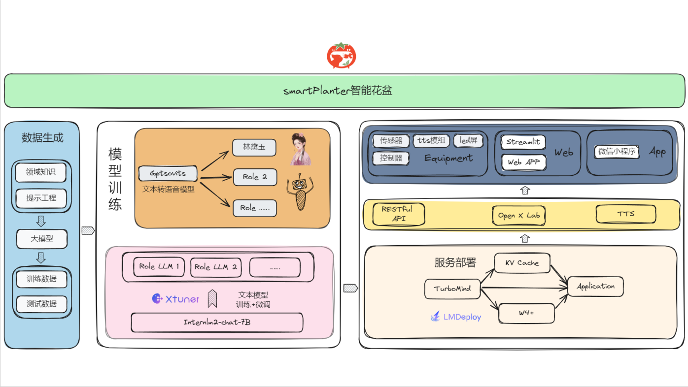
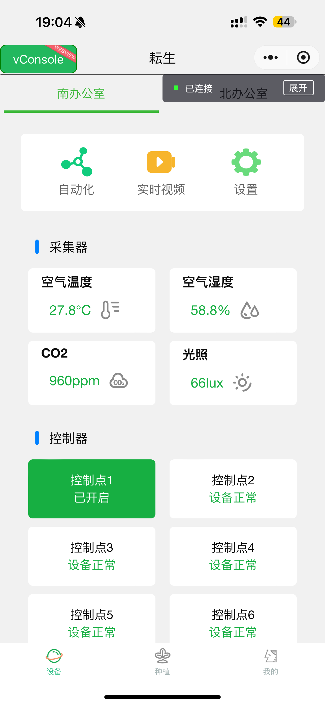
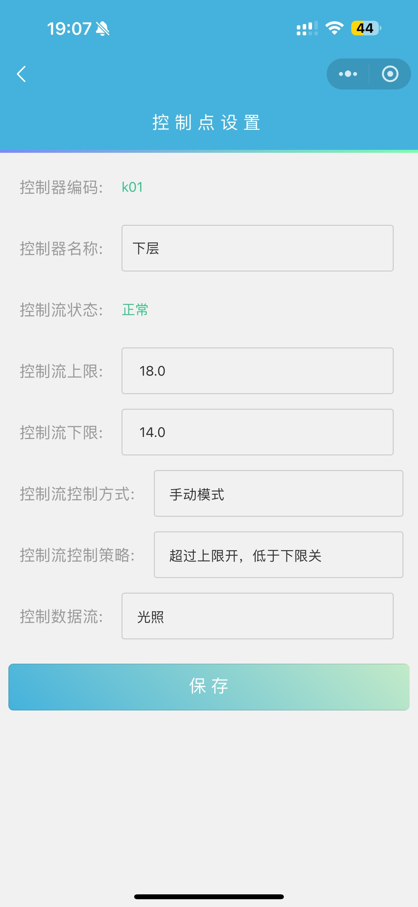

# smartPlanter智能花盆

  耘生系列产品按照载体规格的不同分为两个系列：智能生态柜、智能花盆。 

## 😊 公司背景

深耕农业物联网领域11年的小公司，自研软硬件以及安装

## 😊 团队成员介绍
- 张其来（NLP算法专家）
- 朱筱华（南通市信息网络安全协会特聘专家、嵌入式与物联网专委会委员）
- 丁晓卫（系统分析师）
- 朱晨  （高校教师，从事嵌入式人工智能领域）
- 张莉  （软件工程师）

## 📝 项目简介
### 一个集智能养护与互动娱乐于一体的智能花盆。
- 硬件提供多角色互动聊天，赋予种植知识个性化的表达。
- 不定时掉落来自植物反馈彩蛋。
- 专属小程序，提供远程控制，用户可以随时随地掌握植物状态。同时配备农事专家。
- 可开启全自动养护功能，友好易用。
- 自带液晶屏展示各类丰富内容。
- 另有种植柜系列产品，实现蔬菜水果自由。

### 项目架构图

### 软件关键效果图

## 📝 模型及体验地址
### huggingface地址

### openxlab应用体验地址

## 🖥️ 耘生系列简介
  “耘生”不仅是一款家用种植系统，更是都市人连接自然、享受绿色生活的桥梁。我们致力于将传统的农耕文化与现代科技相融合，打造一个集生态种植、宠物共生、智能管理于一体的家庭绿色生态空间。通过“耘生”，我们希望每一位都市人都能在家中感受到大自然的魅力，享受到亲手耕耘的乐趣，体验与自然和谐共生的美好。 
### 特点
1. 智能监测：采用先进的物联网技术，实现环境数据的实时监测和智能调控，确保植物在最适宜的环境下生长。
2. 模块化设计：种植模块采用可拆卸设计，用户可根据需求自由组合，打造个性化的绿色生态空间。
3. 美观实用：产品外观简约时尚，既可作为家中的装饰品，又能为家庭带来实际的绿色收益。
4. 生态循环：支持生态养殖，将植物与动物融入同一系统，形成生态循环，减少资源浪费。
5. 宠物共生：设计独特的宠物共生区，让宠物与植物共同成长，为家庭增添更多乐趣。
6. 线上互动：通过微信小程序，用户可以分享自己的种植心得和成果，与亲朋好友共同交流、学习。

### 优势
1. 绿色环保：通过生态种植和宠物共生，实现家庭内部的生态平衡，减少碳排放，为环保事业贡献力量。
2. 健康有益：亲手种植和养护植物，不仅可以缓解压力，还能享受到新鲜蔬菜、花卉带来的健康益处。
3. 智能便捷：智能化的管理方式和远程控制功能，让用户随时随地都能关注和管理自己的绿色生态空间。
4. 独特创新：将传统农耕文化与现代科技相结合，打造独具特色的家庭绿色生态空间，引领都市绿色生活新潮流。

### 价值
1. 教育性：通过软件程序趣味性的设计以及有趣的character对话，让知识以一种不经意的方式进入脑子。
2. 公益性：除大田承包户外，国内仍有不少留守老人坚持自己种地，化肥、种子、农药、播种收割成本是一笔相当大的成本。耘生系列产品每售卖一套将拿出净利润的一定比例用于补贴散户购买化肥农药。
3. 个性化和定制化价值：可根据场地大小定制不同规格的智能柜。smartPot产品会训练多种character，可供用户选择喜爱角色。
4. 情感价值：可以提供情感上的慰藉和陪伴，尤其对于独居老人、儿童或需要情感支持的人群来说，它们可以自由对话减少孤独感，提供心理上的安慰。

## 致谢
- 上海人工智能实验室
- 中国农业大学-王耀君老师团队
- GPTSovits

## 联系方式
欢迎大家多多反馈~
- wechat：HelloWorld_testing

